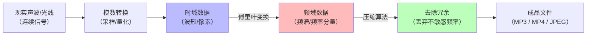

为了让你彻底理解傅里叶变换，我们先抛开复杂的数学公式，从**“换一个角度看世界”**开始。

结合你之前掌握的**音频采样**知识（声音是随时间振动的波形），傅里叶变换恰恰是连接“时域（时间）”和“频域（频率）”的数学桥梁。

---

## 🎹 第一个比喻：弹钢琴的“和弦”

想象一下，你闭着眼睛，听别人同时按下了钢琴上的 **C（261Hz）、E（329Hz）、G（392Hz）** 三个键。

- **你听到的“整体声音”**：是一个浑厚、饱满的**复杂波形**（时域）。
- **傅里叶变换在做什么**：它像一双拥有“绝对音感”的耳朵，直接告诉你说：“这个声音不是单一的，它由 **3个不同频率** 的音符组成，分别是 261Hz、329Hz 和 392Hz，而且响度（振幅）分别是 70%、50% 和 80%。”

**结论**：傅里叶变换的本质，就是把**任何复杂的、乱糟糟的信号（时域）**，彻底拆解成**一堆标准、纯净的正弦波（频域）**的集合。

---

## 🔭 第二个比喻：牛顿的“三棱镜”

这是最经典的类比：
白光（阳光）进入三棱镜，会散开成红、橙、黄、绿、蓝、靛、紫的**彩色光谱（频域）**。

- **进入棱镜前**（时域）：你只看到一束“白色”的光。
- **穿过棱镜后**（频域）：你清晰地看到它内部包含了哪些纯色（频率），以及每种颜色的含量（振幅）。

**傅里叶变换就是数学世界里的“三棱镜”**。它将杂乱无章的“波”分解成纯净的“单色波”。

---

## 🧠 核心概念：时域 vs 频域

在音频处理中，这是两个完全不同的观察维度：

| 维度 | 横轴代表 | 纵轴代表 | 你看到的样子 |
|------|---------|---------|-------------|
| **时域（Time Domain）** | **时间（秒）** | **振幅（响度）** | 像心电图一样上下剧烈跳动的**波形**（录音软件里看到的样子）。 |
| **频域（Frequency Domain）** | **频率（Hz）** | **能量/幅度** | 像一排高低不同的**条形图**（均衡器 EQ 上看到的样子），显示哪个频段的声音更响。 |

> 我们用 **44.1kHz** 采样率去采集声音，采集到的原始数据就是**时域**的波形点；而**傅里叶变换**负责把这些点翻译成**频域**的频谱图。

---

## 📐 直观理解数学公式（不用计算，只看含义）

傅里叶变换的核心思想用白话文翻译就是：

> **任意一个周期函数（复杂波形） = 无数个不同频率、不同振幅、不同相位的正弦波（纯音）的叠加。**

用结构化的伪数学来表示：

```text
复杂信号 (你的声音) 
    = 
(振幅1 × 正弦波(频率1)) 
+ (振幅2 × 正弦波(频率2)) 
+ (振幅3 × 正弦波(频率3)) 
+ ... (直到无穷)
```

简单来说：**再乱的波形，都是一堆“标准波纹”拼凑起来的。**

---

## 💡 为什么它至关重要？（结合你的知识储备）

现在，把你之前掌握的**采样率**和**压缩编码**知识串起来，你会豁然开朗：

### 1. 完美衔接“奈奎斯特采样定理”
你之前记住了“采样率必须大于最高频率的 2 倍”。为什么必须是 2 倍？
因为**傅里叶变换告诉我们**：音频信号是由各种频率的正弦波构成的。为了准确还原一个特定频率（比如 20kHz）的正弦波，一个周期内至少需要采集 2 个点（波峰和波谷）。少了就会丢失这个频率，多了就是浪费。

### 2. 揭开“MP3 / AAC 有损压缩”的黑匣子
为什么 MP3 能把体积缩小 90% 而听感接近？
因为编码器对音频信号**做傅里叶变换**，把时域波形变成频域频谱。然后它发现：
- 人耳对 **16kHz~20kHz** 的高频不敏感（听觉掩蔽效应）。
- 人耳对微弱的背景音不敏感。

于是，编码器**直接砍掉（丢弃）** 这些人耳不敏感的频率数据，只保留最主要的频段。这个过程叫**“心理声学模型”**，而它依赖的第一步就是傅里叶变换。

### 3. 图像 / 视频压缩（JPEG / H.265）
别看视频是平面的，它依然可以应用傅里叶变换的变种（**DCT，离散余弦变换**）。
压缩算法把一张 8×8 的像素小块拿来做变换，将“空间细节”转化为“频率细节”：

- **低频部分**（大面积相同颜色的背景）——**保留**（占用少量数据）。
- **高频部分**（剧烈的边缘、噪点、纹理）——**丢弃**（因为人眼对高频细节不敏感）。

这就是视频编码能把你之前算出的 **1.44GB/秒** 原始数据压缩到几十 MB 的数学根基。

---

## 🔄 完整逻辑闭环（图例说明）



---

## 🧩 日常生活中的傅里叶变换

- **降噪耳机**：采集环境噪声（时域）→ 傅里叶变换分析出主要噪声频率 → 生成反向相位波（反傅里叶）抵消噪音。
- **语音助手（唤醒词识别）**：把“你好小爱”这句话变成频域指纹，忽略音量大小和音色差异，只比对频率特征，从而精准识别。
- **心电图（ECG）**：医生通过傅里叶变换看心率变异性，从杂乱的心跳波形中提取出异常频率，判断房颤等疾病。

---

## 📌 一句话终极总结

> **傅里叶变换就是一个“万能拆解器”**：无论你在时域里看到的波形多么扭曲、复杂、难以理解，只要把它扔进傅里叶变换，它就会还给你一张极其清晰的“成分表”——上面精确写明了这个信号是由哪些纯净的“频率砖块”搭建而成的。

如果你好奇**“离散余弦变换（DCT）和标准傅里叶变换有什么区别”**，或者**“为什么视频压缩用 DCT 而不用标准傅里叶”**，我们可以接着深入 JPEG / H.265 的内部工作机制。😊