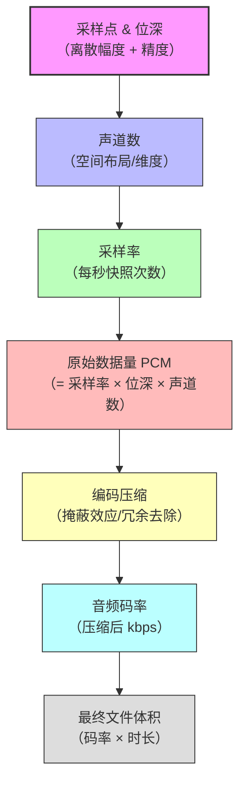

# 音频技术核心概念完全指南：从采样到比特率

> 一份图文并茂的依赖关系图谱，完全沿用视频领域的推导逻辑，帮你彻底搞懂“无损”“采样率”“码率”等音频术语的本质。

---

## 📌 阅读指引

本文是视频概念体系的**完美镜像**。你会发现，音频和视频在数据流上的底层逻辑惊人地一致：

- **视频的“像素”** 对应 **音频的“采样点”**
- **视频的“分辨率（画布大小）”** 对应 **音频的“声道数量（空间布局）”**
- **视频的“帧率（时间密度）”** 对应 **音频的“采样率（时间密度）”**

下文按照 **微观 → 空间 → 动态 → 原始数据 → 成品** 逐层推进，最后串联成完整的知识闭环。

---

## 🧱 第一层：采样点（Sample）与位深（Bit Depth）—— 声音的“原子”

### 什么是采样点？
- 模拟声波是连续的曲线，数字音频只能记录这条曲线上的**离散点**（采样点）。就像用无数个点连成一条折线去逼近一条光滑曲线。
- 每个采样点记录的是该时刻声波的**振幅（响度）**。

### 什么是位深（Bit Depth）？
- 位深决定了**每个采样点用多少二进制位（bit）** 来描述振幅的精细度。
- 常见位深：
  - **16bit**：每个采样点有 65536（2¹⁶）个振幅等级。这是 **CD 标准**，动态范围约 96dB。
  - **24bit**：每个采样点有 1677 万个等级。这是**录音室标准**，动态范围约 144dB，提供更大的后期处理空间（如压限、EQ 调整）。
  - **32bit 浮点**：现代高端录音机采用，几乎不可能出现“削波失真”，后期救回高动态素材的神器。

### 占用空间（未压缩）
- 一个 16bit 的单声道采样点 = **2 字节**。
- 一个 24bit 的单声道采样点 = **3 字节**。

> 🧠 **记忆点**：采样点是声音的“快照”，位深是每张快照的“灰度精度”（决定了能记录多小的声音细节）。

---

## 🖼️ 第二层：声道数（Channel）—— 声场的“画布”

### 定义
- 声道数决定了声音的**空间维度**（布局），类似于视频分辨率中的“宽×高”决定画面大小。
- 它表示在同一时刻录制的独立音频信号数量。

### 常见标准

| 名称 | 声道配置 | 俗称 | 对应视频类比 |
|------|----------|------|-------------|
| 单声道 | 1.0（仅中置） | Mono | 黑白电视（单维度） |
| 立体声 | 2.0（左+右） | Stereo | 标准高清画布 |
| 环绕声 | 5.1（左/右/中/后左/后右 + 低音炮） | 5.1 Surround | 宽银幕电影 |
| 全景声 | 7.1.4（7 个环绕 + 1 个低音 + 4 个天空） | Dolby Atmos | 3D/VR 空间 |

### 数据量的影响
- 立体声的数据量 = 单声道的 **2 倍**。
- 5.1 环绕声（6 个通道）的数据量 = 单声道的 **6 倍**。

> 🧠 **记忆点**：声道是声音的“房间布局”，单声道是一个点，立体声是一根线，环绕声是一个球体。

---

## ⏱️ 第三层：采样率（Sample Rate）—— 时间的“帧率”

### 定义
- 采样率 = **每秒对声波采集的快照次数**，单位 **Hz（赫兹）** 或 **kHz（千赫兹）**。
- 它决定了声音的**频率响应上限**（即能记录多高的音调），同时也决定了动态的细腻度。

### 奈奎斯特采样定理（黄金法则）
> **采样率必须 ≥ 2 × 最高频率**，才能无损还原波形。  
> 人耳听觉上限约 **20kHz**，所以理论最低采样率为 **40kHz**。

### 常用采样率与场景

| 采样率 | 最高还原频率 | 典型用途 | 对应视频帧率类比 |
|--------|-------------|----------|-----------------|
| 44.1 kHz | 22.05 kHz | **CD 标准**，音乐发行 | 24fps（电影工业铁律） |
| 48 kHz | 24 kHz | **电影/电视/专业视频** 标准（优于 CD） | 25fps/30fps（广电标准） |
| 96 kHz | 48 kHz | 录音室母带、Hi-Res 高解析音频 | 60fps（高帧率游戏/体育） |
| 192 kHz | 96 kHz | 极高端录音、声学分析 | 120fps（超高速慢动作） |

> ⚠️ 注意：普通人耳无法直接听出 44.1kHz 和 96kHz 的区别。更高采样率的主要价值在于**后期处理**（时间拉伸、音高偏移时减少失真）和**设备抗锯齿滤波**。

> 🧠 **记忆点**：采样率是“每秒截取多少个时间切片”，决定了能捕捉多快的振动（高频声音）。

---

## 📦 第四层：原始数据量（PCM / WAV）—— 物理带宽的硬约束

### 计算公式
```
原始数据量 (字节/秒) = 采样率 (Hz) × 位深 (字节) × 声道数
```

### 示例演算（CD 音质，未压缩）
以 **44.1kHz / 16bit / 立体声（2 声道）** 为例：

- 每秒采样点数：44,100 个
- 每个采样点字节数：16bit = **2 字节**
- 声道数：**2**
- 每秒字节数：44,100 × 2 × 2 = **176,400 字节/秒 ≈ 172 KB/秒**
- 换算成比特率：172 KB × 8 = **1.41 Mbps**（这就是 CD 品质的原始码率）

### 示例演算（Hi-Res 高解析，未压缩）
以 **192kHz / 24bit / 立体声（2 声道）** 为例：

- 每秒字节数：192,000 × 3 × 2 = **1,152,000 字节/秒 ≈ 1.1 MB/秒**
- 换算成比特率：1.1 MB × 8 = **9.2 Mbps**

> 💥 1 小时的 192kHz/24bit 立体声母带 = 1.1 MB × 3600 ≈ **4 GB**。如果是 5.1 环绕声（6 声道），则再乘以 3 倍，达到 **12 GB/小时**。

> 🧠 **记忆点**：原始数据量 = 每秒截取的快照数量 × 每张快照的精度 × 录音机数量（声道）。

---

## 🗜️ 第五层：编码压缩（Codec）与码率（Bitrate）—— 成品的大小

### 为什么需要压缩？
- 1 小时的 CD 级 PCM 需要约 **635 MB**（176KB/s × 3600），虽然比视频小，但在流媒体和移动设备上依然臃肿。
- 更重要的是，**人耳存在“听觉掩蔽效应”**（大声掩盖小声、高频掩盖低频），利用这一点可以大幅砍掉人耳听不到的数据。

### 常见音频编码与类型

| 编码格式 | 类型 | 典型码率 | 特点 |
|----------|------|----------|------|
| **PCM / WAV** | 无损未压缩 | 1.41 Mbps (CD) | 原始数据，音质天花板 |
| **FLAC / ALAC** | 无损压缩 | ~700~900 kbps | 像 ZIP 压缩，还原后与原始完全一致，体积约为 PCM 的 50%~60% |
| **MP3** | 有损压缩 | 128kbps / 320kbps | 老牌格式；320kbps 听感接近 CD，但高频细节有缺失 |
| **AAC** | 有损压缩 | 128kbps ~ 256kbps | 苹果/YouTube 标准；同等码率下音质优于 MP3 |
| **Opus** | 有损压缩 | 32kbps ~ 512kbps | 现代最强有损编码，WebRTC/语音通话标配，低码率下表现极佳 |

### 码率与音质的平衡（类比视频）
- **高码率 + 无损编码**（如 FLAC 900kbps）= 视频领域的“蓝光原盘”，保留了所有细节。
- **低码率 + 有损编码**（如 MP3 128kbps）= 视频领域的“低码率流媒体”，砍掉了人耳不敏感的频率（极高频和极低频），换来了体积缩小约 **90%**。

> 🧠 **记忆点**：编码是“心理声学打包术”。有损压缩像 JPEG 图片去掉肉眼不敏感的细节；无损压缩像 PNG/ZIP，还原后和原来一模一样。

---

## 🔗 完整依赖关系图（Mermaid 流程图）



### 图解说明
1. **采样点 & 位深** 是音频的地基（单次快照的数据量）。
2. **声道数** 决定了有多少组并行记录仪（维度/画布）。
3. **采样率** 决定了一秒钟按多少次快门（时间密度）。
4. 三者相乘得到 **原始 PCM 数据量**（物理极限）。
5. **编码** 利用人耳弱点疯狂瘦身，生成 **码率**。
6. 码率乘以时长，就是最终的 **MP3/FLAC 文件大小**。

---

## 🧪 实战推演：从录音到播放的全流程

假设你在录音棚录制一首 **5 分钟** 的歌曲，采用 **192kHz / 24bit / 立体声** 录音，最终导出为 **320kbps 的 MP3**。

### 步骤拆解
1. **单采样点大小**：24bit = 3 字节。
2. **每秒原始数据**：192,000 × 3 字节 × 2（声道） = **1,152,000 字节/秒 ≈ 1.1 MB/秒**。
3. **5 分钟原始母带体积**：1.1 MB × 300 秒 = **330 MB**（WAV 格式）。
4. **压缩为 MP3**：320kbps = 320 ÷ 8 = **40 KB/秒**。
5. **5 分钟 MP3 体积**：40 KB × 300 秒 = **12,000 KB ≈ 12 MB**。

> ✅ 从 330MB 压缩到 12MB，体积缩小了 **27.5 倍**，而普通人耳盲听基本分辨不出差异。这就是音频编码的魔力。

---

## 📊 概念对比一览表（视频 vs 音频）

| 维度 | 🎬 视频术语 | 🎵 音频术语 | 核心决定因素 | 类比 |
|------|------------|------------|-------------|------|
| **微观单元** | 像素（Pixel） | 采样点（Sample） | 传感器 / ADC 时钟 | 砖块 |
| **精度** | 色深（Bit Depth） | 位深（Bit Depth） | 量化等级 | 颜料丰富度 |
| **空间维度** | 分辨率（宽×高） | 声道数（Ch） | 传感器阵列 / 麦克风数量 | 画布尺寸 |
| **时间密度** | 帧率（FPS） | 采样率（Hz） | 刷新/采集频率 | 翻页速度 |
| **原始流量** | 视频带宽（Gbps） | PCM 码率（Mbps） | 上述三者相乘 | 水龙头流量 |
| **压缩算法** | H.264 / H.265 | MP3 / AAC / FLAC | 变换编码 / 心理模型 | 真空压缩袋 |
| **成品指标** | 视频码率（Mbps） | 音频码率（kbps） | 编码器设定 | 压缩后水流 |

---

## 🧩 常见误区澄清（音频专版）

❌ **误区 1**：“采样率越高，声音一定越好听。”  
✅ **正解**：44.1kHz 已覆盖人耳听觉极限（20kHz）。96kHz 以上的价值主要体现在**后期编辑**（如变速变调不产生失真）和**设备性能**（简化抗混叠滤波器设计），而非直接“听感升级”。

❌ **误区 2**：“320kbps MP3 和无损 WAV 完全一样。”  
✅ **正解**：320kbps MP3 砍掉了 16kHz 以上的极高频成分和部分瞬态响应（如镲片的泛音）。在顶级监听设备上盲听可辨，但在普通耳机/车载音响上几乎无区别。

❌ **误区 3**：“声道越多，音质越好。”  
✅ **正解**：声道多只代表**包围感**和**定位感**增强（如飞机从头顶飞过），不代表解析力或动态提升。2.0 立体声高码率 Hi-Res 的音乐性往往优于低码率的 5.1 电影音轨。

❌ **误区 4**：“FLAC 能压缩到原始体积的 50% 以下，肯定损失了音质。”  
✅ **正解**：FLAC 是无损压缩（类似 ZIP 解压），解码后还原的 PCM 数据与原始 WAV 每个比特都完全相同。只是利用音频信号的冗余度（如静音段落）进行数学瘦身。

---

## 🎯 最终小结（与视频公式完美对称）

```
采样点（位深） → 声道数 → 采样率 → 原始数据量（PCM） → 编码 → 码率 → 文件体积
```

| 听感维度 | 决定因素 |
|---------|----------|
| **解析力 / 细节** | 位深（动态范围） + 码率（数据丰度） |
| **频率范围 / 清晰度** | 采样率（奈奎斯特上限） |
| **空间感 / 临场感** | 声道数（布局） + 混音技术 |
| **文件大小** | 码率 × 时长 |

当你看到音频产品宣传“192kHz/24bit”或“无损 Hi-Res”时，只需沿着这条链条思考：

- **它真的有用吗？**（取决于你的播放设备和解码器）
- **体积能接受吗？**（1 小时 4GB 起步）
- **我最终要存成什么格式？**（流媒体选 AAC/Opus，本地收藏选 FLAC）

---

> ✍️ 本文是 **视频技术概念指南** 的姊妹篇，采用完全相同的推导逻辑构建。你能轻松读懂这篇，说明视频篇的知识已经内化。欢迎将本文用作速查手册，遇到困惑时顺着依赖链条反推即可理清头绪。😊