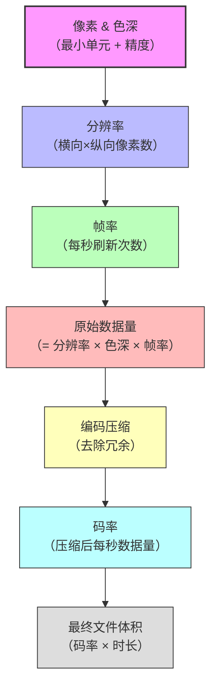

# 视频技术核心概念完全指南：从像素到码率

> 一份图文并茂的依赖关系图谱，帮你彻底搞懂“高清”“4K”“帧率”“码率”等术语背后的逻辑。

---

## 📌 阅读指引

本文按照 **微观 → 宏观 → 动态 → 成品** 的逻辑逐层推进。每一层都是下一层的基础，最终串联成完整的知识体系。  
文中包含 **Mermaid 流程图**（若你的 Markdown 阅读器支持渲染，将显示为图形；若不支持，可查看代码块的文本结构）。

---

## 🧱 第一层：像素（Pixel）与色深（Bit Depth）—— 一切的原子

### 什么是像素？
- 像素（Pixel）是数字图像的最小组成单元，就像砖块之于墙壁。
- 每个像素记录一个颜色值，多个像素排列成网格就构成了整幅画面。

### 什么是色深？
- 色深决定了**每个像素用多少二进制位（bit）** 来表示颜色。
- 常见的色深：
  - **8bit 每通道**：每个颜色通道（红/绿/蓝）用 8bit，即 256 级灰度，总共可表达 1600 万种颜色（`256^3`）。这是大多数常规视频的标准。
  - **10bit 每通道**：每个通道 1024 级，色彩过渡更平滑，主要用于 HDR 视频。

### 占用空间（未压缩）
- 一个 8bit RGB 像素 = 3 个通道 × 1 字节/通道 = **3 字节**。
- 一个 10bit RGB 像素 ≈ **3.75 字节**（实际按 4 字节对齐）。

> 🧠 **记忆点**：像素是画布上的「点」，色深是每个点的「颜料精度」。

---

## 🖼️ 第二层：分辨率（Resolution）—— 画布的大小

### 定义
- 分辨率 = **横向像素数 × 纵向像素数**，例如 `1920×1080`。
- 它决定了画面的**精细度**（空间细节）。

### 常见标准

| 名称 | 分辨率（宽×高） | 总像素数 | 俗称 |
|------|----------------|----------|------|
| 标清（SD） | 720×576 | 约 41 万 | 480p/576p |
| 高清（HD） | 1280×720 | 约 92 万 | 720p |
| 全高清（FHD） | 1920×1080 | 约 207 万 | 1080p |
| 4K（UHD） | 3840×2160 | 约 830 万 | 4K 超高清 |
| 影院 4K（DCI） | 4096×2160 | 约 885 万 | 真正的 4K |

### 4K 的特殊性
- **4K 的「K」指横向约 4000 像素**（定义看宽度，不是总面积）。
- 在固定 16:9 比例下，4K 的总像素是 1080p 的 **4 倍**。

> 🧠 **记忆点**：分辨率是画布的尺寸，4K 是一块特别大的画布。

---

## ⏱️ 第三层：帧率（Frame Rate, FPS）—— 时间的分辨率

### 定义
- 帧率 = **每秒显示的画面张数**，单位 fps（frames per second）。
- 它决定了运动的**流畅度**（时间细节）。

### 常用帧率与场景

| 帧率 | 典型用途 | 感受 |
|------|----------|------|
| 24 fps | 电影胶片 | 经典「电影感」，略带顿挫 |
| 25 fps | 中国/欧洲电视（PAL） | 新闻、电视剧 |
| 30 fps | 美国/日本电视（NTSC） | 常规网络视频 |
| 60 fps | 体育、游戏、高帧率视频 | 极度顺滑，减少拖影 |
| 120+ fps | 慢动作拍摄 | 用于后期放慢 |

### 与分辨率的关系
- **空间分辨率**（清晰度）和 **时间分辨率**（流畅度）是独立的两个维度。
- 高分辨率 + 低帧率 → 静态清晰，动态模糊（如 4K@24fps 电影）。
- 低分辨率 + 高帧率 → 动态流畅，但细节不足（如 720p@120fps 游戏）。

> 🧠 **记忆点**：帧率是「每秒多少次快门」，决定了运动的细腻程度。

---

## 📦 第四层：原始数据量（Raw Data Rate）—— 物理带宽的硬约束

### 计算公式
```
原始数据量 (字节/秒) = 分辨率宽度 × 分辨率高度 × 每像素字节数 × 帧率
```

### 示例演算
以 **4K（3840×2160）、8bit RGB（3 字节/像素）、60fps** 为例：

- 单帧像素数：3840 × 2160 = **8,294,400** 像素
- 单帧字节数：8,294,400 × 3 = **24,883,200 字节 ≈ 23.7 MB**
- 每秒字节数：23.7 MB × 60 = **1,422 MB ≈ 1.42 GB/秒**

> 💥 **这就是为什么不能直接存储原始视频**——1 分钟就要 85 GB，任何存储卡和网络都扛不住。

### 关键依赖
- 原始数据量 = 像素（色深） × 分辨率（面积） × 帧率（刷新速度）
- **三者任何一个增加，数据量都会线性增长**。

> 🧠 **记忆点**：原始数据量是「水龙头流出的总水量」，由管径（分辨率）、水压（色深）和时间（帧率）共同决定。

---

## 🗜️ 第五层：编码压缩（Codec）与码率（Bitrate）—— 成品的大小

### 为什么需要压缩？
- 原始数据量巨大，必须通过算法**去除冗余信息**（人眼不敏感的色彩、空间重复、时间重复等）。
- 常见的视频编码标准：H.264（AVC）、H.265（HEVC）、VP9、AV1 等。

### 什么是码率（Bitrate）？
- 码率 = **压缩后每秒的数据量**，单位通常为 **Mbps（兆比特/秒）** 或 **MB/s（兆字节/秒）**。
- 码率越高，保留的原始信息越多，画质越好，但文件体积也越大。

### 码率与画质的平衡
- **高分辨率 + 低码率** → 画面模糊、色块明显（例如视频网站的低码率 4K）。
- **低分辨率 + 高码率** → 画面干净锐利（例如蓝光原盘的 1080p）。

> 🧠 **记忆点**：编码是「压缩打包术」，码率是「压缩包的大小」。原始画质是巨大的「实心铁球」，压缩后变成「膨化食品」——体积小了，但营养（画质）看压缩比。

---

## 🔗 完整依赖关系图（Mermaid 流程图）



### 图解说明
1. **像素 & 色深** 是基石，决定了每个点的数据量。
2. **分辨率** 将像素排列成二维画布。
3. **帧率** 将画布在时间轴上重复播放。
4. 三者相乘得到 **原始数据量**，这是物理极限。
5. **编码** 大刀阔斧压缩，产生 **码率**。
6. 最终，码率乘以时长，就是你在硬盘上看到的 **文件大小**。

---

## 🧪 实战推演：从拍摄到存储的全流程

假设你要拍摄一段 **4K / 60fps / 10bit HDR** 的素材，相机设定码率为 **200 Mbps**（H.265 编码），时长 **1 分钟**。

### 步骤拆解
1. **像素信息**：10bit 每通道 ≈ 1.25 字节/通道，RGB 三通道 ⇒ 每像素 ≈ 3.75 字节。
2. **单帧大小**：3840 × 2160 × 3.75 ≈ **31.1 MB**。
3. **每秒原始数据**：31.1 MB × 60 ≈ **1.87 GB/秒**。
4. **每秒压缩后数据**：200 Mbps = 200 ÷ 8 = **25 MB/秒**。
5. **1 分钟文件体积**：25 MB × 60 = **1.5 GB**。

> ✅ 如果没有压缩，1 分钟将占用 1.87 GB × 60 ≈ **112 GB**。压缩后仅 1.5 GB，缩小了近 **75 倍**！

---

## 📊 概念对比一览表

| 概念 | 维度 | 单位 | 决定因素 | 类比 |
|------|------|------|----------|------|
| 像素 | 空间点 | 个 | 传感器物理单元 | 砖块 |
| 色深 | 颜色精度 | bit | 模数转换器 | 颜料种类 |
| 分辨率 | 空间大小 | 宽×高 | 像素总数 | 画布尺寸 |
| 帧率 | 时间密度 | fps | 刷新速度 | 翻页速度 |
| 原始数据量 | 物理带宽 | MB/s / Gbps | 分辨率×色深×帧率 | 水流量 |
| 编码 | 压缩算法 | – | 数学变换 | 真空压缩袋 |
| 码率 | 压缩后流量 | Mbps / MB/s | 编码器设定 | 压缩后水流 |

---

## 🧩 常见误区澄清

❌ **误区 1**：4K 就是指总像素 830 万。  
✅ **正解**：4K 指横向约 4000 像素，830 万是固定 16:9 下的总像素。

❌ **误区 2**：高分辨率 = 高画质，不用管码率。  
✅ **正解**：分辨率只决定画布大小，码率决定画布上信息的丰满度。低码率的 4K 甚至不如高码率的 1080p 清晰。

❌ **误区 3**：帧率越高画面越“高清”。  
✅ **正解**：帧率提升的是流畅度，不是清晰度。高清（分辨率）和流畅（帧率）是独立的两个指标。

❌ **误区 4**：像素占用的存储空间是固定的。  
✅ **正解**：未压缩时取决于色深和通道数；压缩后取决于编码算法和码率，不再按“每像素”计算。

---

## 🎯 最终小结

```
像素（色深） → 分辨率 → 帧率 → 原始数据量 → 编码 → 码率 → 文件体积
```

- **清晰度** = 分辨率（空间） × 码率（数据丰度）
- **流畅度** = 帧率（时间）
- **文件大小** = 码率 × 时长

当你选购设备、设置参数或对比画质时，只需沿着这条链条思考，就能迅速抓住本质，不再被营销话术迷惑。

---

> ✍️ 本文由你与 AI 的对话整理而成，旨在构建一个自洽的知识框架。如有疑问或想深入某个环节，欢迎继续探讨！